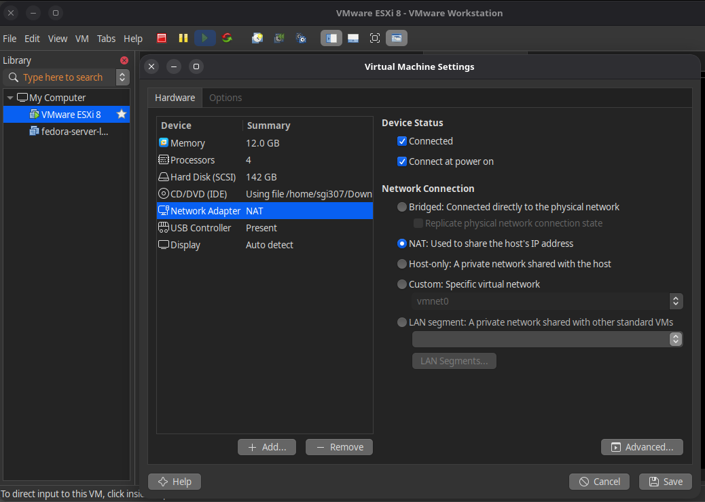
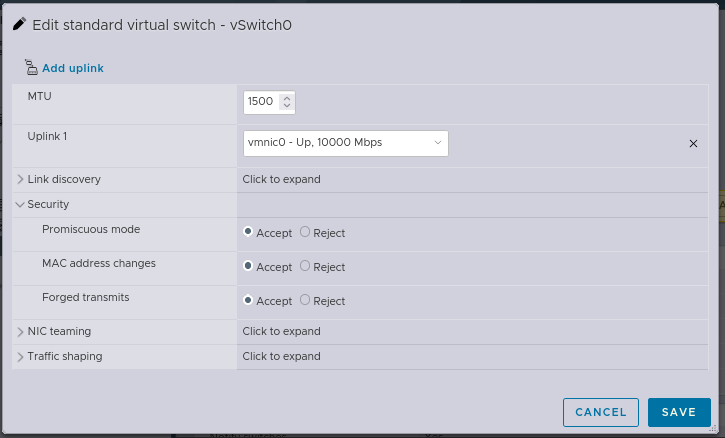
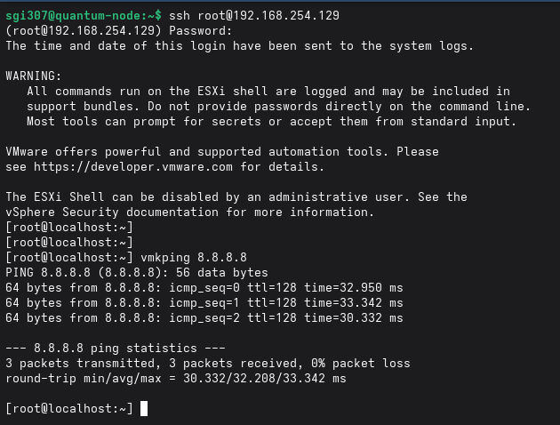
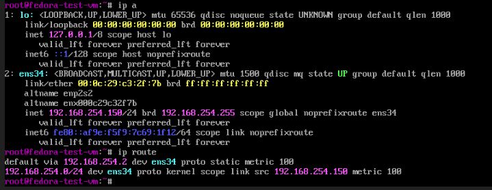
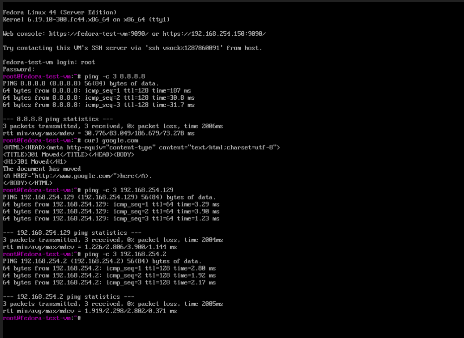

# Nested ESXi Networking Lab on Fedora Linux

## Project Overview

This project documents the design, deployment, troubleshooting, and documentation of a nested VMware ESXi environment running on VMware Workstation hosted on Fedora Linux.

The primary objective was not only to build the environment but also to understand the networking concepts involved and develop a structured troubleshooting methodology for diagnosing connectivity issues within nested virtualization environments.

---

## Objectives

- Deploy VMware ESXi as a nested hypervisor.
- Configure virtual networking for nested guest workloads.
- Provide Internet access to guest virtual machines.
- Investigate and resolve networking failures systematically.
- Develop reusable operational documentation and knowledge base articles.

---

## Environment

| Component              | Technology          |
| ---------------------- | ------------------- |
| Physical Host          | Fedora Linux        |
| Desktop Hypervisor     | VMware Workstation  |
| Nested Hypervisor      | VMware ESXi         |
| Guest Operating System | Fedora Linux        |
| Network Mode           | VMware NAT (VMnet8) |
| Virtual Switch         | ESXi vSwitch0       |

---

## Network Topology

```text
Physical Fedora Laptop (Wi-Fi)
        ↓
VMware Workstation (VMnet8 NAT)
        ↓
Nested ESXi Host
        ↓
vSwitch0 → VM Network
        ↓
Nested Fedora Guest VM
```

---

## Key Challenges

- Bridged networking limitations over Wi-Fi.
- ESXi vSwitch security restrictions in nested environments.
- DHCP failures within nested virtualization layers.
- Linux-specific VMware virtual network permission issues.
- Identifying the correct troubleshooting layer during diagnosis.

---

## Troubleshooting Highlights

- Verified connectivity using hierarchical ping testing.
- Utilized `vmkping` to validate ESXi management network functionality.
- Examined virtual switch and port group configurations using ESXCLI.
- Investigated ARP behavior and routing tables inside guest systems.
- Implemented static addressing to isolate DHCP-related failures.
- Resolved Linux host virtual networking permission issues.

---

## Skills Demonstrated

- VMware Workstation administration
- VMware ESXi networking
- Linux networking fundamentals
- NetworkManager administration
- Virtual switch troubleshooting
- Root cause analysis
- Technical documentation
- Systematic problem solving

---

## Documentation

Additional documentation for this project can be found in the following directories:

- `docs/` – Knowledge base articles, topology documentation, and lessons learned.
- `configs/` – Configuration notes and command references.
- `screenshots/` – Visual references from the lab environment.

---

## 📸 Lab Evidence (Click to Expand)

<details>
<summary><strong>1. VMware Workstation NAT (VMnet8)</strong></summary>

Shows NAT configuration used as the upstream network for the nested ESXi environment.



</details>

---

<details>
<summary><strong>2. ESXi vSwitch Security Configuration</strong></summary>

Required settings to allow nested VM traffic (MAC spoofing + forwarding).



</details>

---

<details>
<summary><strong>3. ESXi Management Network Connectivity</strong></summary>

Confirms ESXi host (vmk0) has upstream connectivity.



</details>

---

<details>
<summary><strong>4. Fedora Guest VM IP Configuration</strong></summary>

Verifies correct IP assignment inside nested guest VM.



</details>

---

<details>
<summary><strong>5. End-to-End Internet Connectivity Test</strong></summary>

### Final Validation Result

✔ Guest VM → ESXi Host  
✔ ESXi Host → VMware Workstation NAT Gateway  
✔ VMware Workstation → Internet (Wi-Fi)



</details>

---

## Lessons Learned

Building the environment was only part of the goal. The main value was understanding how the components work together and learning a repeatable way to troubleshoot network issues.

It reinforced the need to check each layer step by step before moving on.
