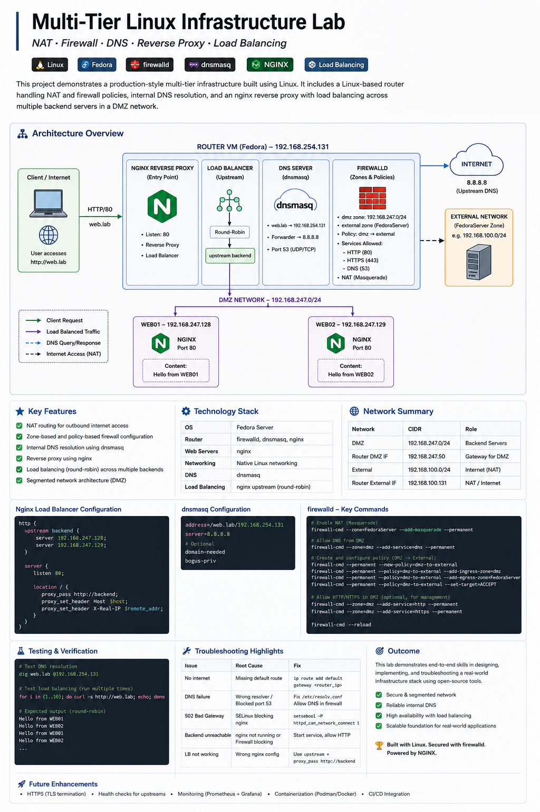
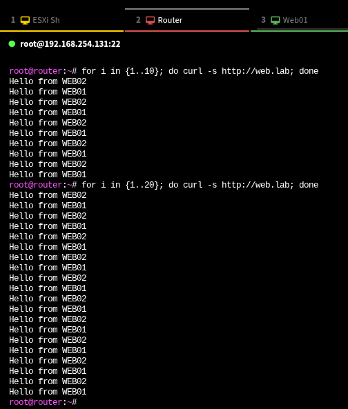
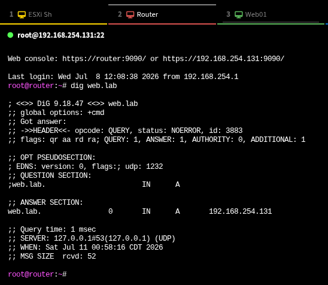
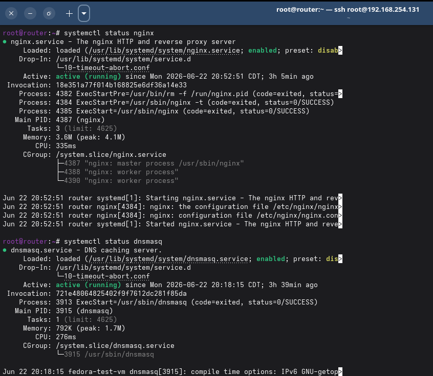
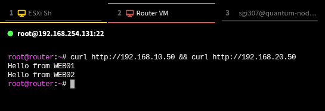
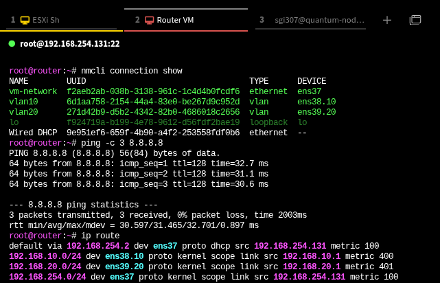

#  Nested ESXi Infrastructure Lab (Fedora Linux)


---

## 📌 Overview

This project demonstrates a **full-stack homelab infrastructure** built on Fedora Linux using nested VMware ESXi.

It evolves from basic virtualization into a **production-style multi-tier architecture**, including networking, firewalling, DNS, and load balancing.

---

## 🧱 Lab Evolution

### 🔹 Phase 1 — Virtualization (ESXi)

- Nested ESXi deployment on Fedora
- Virtual networking setup
- VM provisioning and management

---

### 🔹 Phase 2 — Networking & Routing

- Linux-based router VM
- NAT configuration (masquerade)
- Multi-network segmentation

---

### 🔹 Phase 3 — Security (Firewall)

- firewalld zones (DMZ, external)
- Policy-based forwarding
- Controlled traffic between networks

---

### 🔹 Phase 4 — Infrastructure Services 

Extended the lab into a multi-tier infrastructure by implementing:

- Internal DNS using `dnsmasq`
- Nginx reverse proxy for centralized access
- Load balancing across multiple backend servers
- Segmented DMZ-based architecture
---

## 🏗️ High-Level Architecture (Click to Expand)

<details>
<summary><strong>Logical Topology</strong></summary>

Illustrates the overall architecture, including the upstream NAT network, nested ESXi layer, and downstream multi-tier infrastructure (router, DNS, reverse proxy, and backend servers).



</details>

---

    Fedora Host
        ↓
    Nested ESXi
        ↓
    Router VM (NAT + Firewall + DNS + Nginx)
        ↓
    DMZ Network
        ├── web01
        └── web02

---

## 📸 Validation Screenshots (Click to Expand)

<details>
<summary><strong>1. Load Balancing Verification</strong></summary>

Demonstrates nginx distributing requests across backend servers (web01 & web02).



</details>

---

<details>
<summary><strong>2. DNS Resolution (web.lab)</strong></summary>

Confirms internal DNS resolution via dnsmasq.



</details>

---

<details>
<summary><strong>3. Router Services Status</strong></summary>

Verifies nginx and dnsmasq are running on the router VM.



</details>

---

<details>
<summary><strong>4. Backend Server Verification</strong></summary>

Direct access to backend servers confirms individual node availability.



</details>

---

<details>
<summary><strong>5. Network Connectivity</strong></summary>

Validates network connectivity and routing from the backend VM, including default gateway and external reachability.



</details>

## 🌐 Key Features

- ✅ Nested virtualization (ESXi on Fedora)
- ✅ Multi-network design
- ✅ NAT routing and gateway configuration
- ✅ Firewall segmentation using firewalld
- ✅ Internal DNS resolution
- ✅ Reverse proxy and load balancing
- ✅ Real-world troubleshooting scenarios

---

## 🧠 Key Skills Demonstrated

- Linux system administration
- Network design and troubleshooting
- Firewall and security configuration
- DNS and name resolution
- Reverse proxy and load balancing
- Infrastructure debugging and root cause analysis

---

## 📂 Project Structure

```id="struct1"
── multi-tier-infra
│   ├── assets
│   │   ├── architecture.png
│   │   ├── backend-servers.png
│   │   ├── dns-resolution.png
│   │   ├── load-balancing-proof.png
│   │   ├── network-connectivity.png
│   │   └── router-services.png
│   ├── configs
│   │   ├── dnsmasq.conf
│   │   ├── firewalld.conf
│   │   └── nginx.conf
│   ├── docs
│   │   ├── architecture-notes.md
│   │   └── troubleshooting-kb.md
│   └── README.md

```

---

## 📈 Outcome

This project demonstrates the ability to build, scale, and troubleshoot a **multi-layered infrastructure stack**, mimicking industry-standard enterprise patterns used extensively across DevOps, Infrastructure Automation, and Systems Engineering disciplines.

---

## 📌 Resume Summary

> Built a nested ESXi lab on Fedora Linux and implemented a multi-tier infrastructure including NAT routing, firewalld-based segmentation, internal DNS using dnsmasq, and an nginx reverse proxy with load balancing across multiple backend servers.

---

##  Future Enhancements

- [ ] Automated SSL/TLS Termination (Local Root Authority Certificates)
- [ ] Containerized Microservice Pods (Podman/Docker engine integrations)
- [ ] Centralized Telemetry Logging (Prometheus metric collectors & Grafana interfaces)
- [ ] Infrastructure as Code (Automating ESXi deployment maps with Terraform/Ansible)

---
